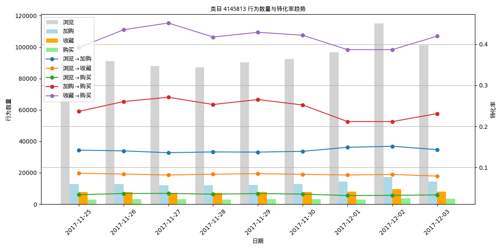
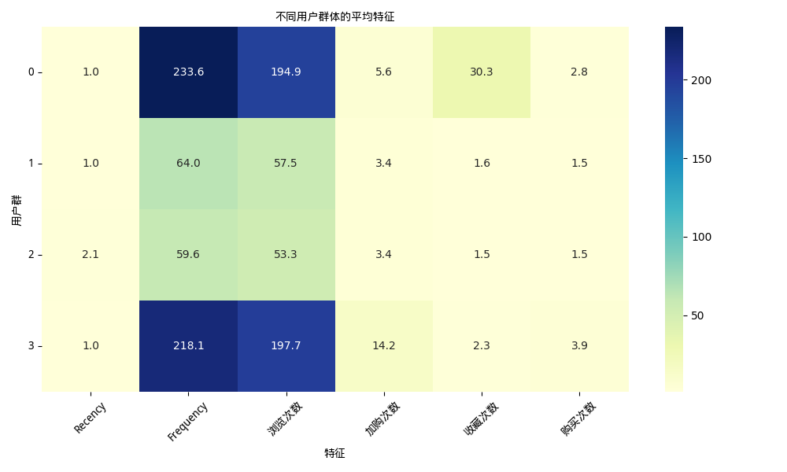

# 🛒 User Behavior Analysis (Alibaba Dataset)

本项目基于阿里巴巴天池 `UserBehavior.csv` 用户行为日志数据，开展多维度的用户行为分析，涵盖数据预处理、漏斗转化率分析、用户画像构建、行为序列挖掘等模块，旨在探索典型用户行为模式与商品转化特征，为产品运营提供数据支持。

---

## 📁 项目结构说明
    user-behavior-analysis/

├── notebooks/ # Jupyter分析模块

├── figures/ # 所有图表输出

├── requirements.txt # Python环境依赖包

└── README.md # 项目说明文档（当前文件）


---
## 数据集 

- https://tianchi.aliyun.com/dataset/649 淘宝用户购物行为数据集

---

## 📊 分析模块概览

### 1️⃣ 数据预处理
- 异常值剔除
- 日粒度数据统计分析
- 日购买转化率分析为
- 行为小时分布分析
- 用户活跃及留存率分析

### 2️⃣ 用户漏斗转化分析
- 分析路径：浏览 → 加购 / 收藏 → 购买
- 日粒度 + 品类维度趋势分析
- 转化率可视化折线图 + 柱状叠加图

### 3️⃣ 用户画像分析
- 基于 RFM 模型提取特征
- 使用 KMeans 聚类形成用户标签
- 可扩展至预测模型建模（XGBoost）

---

#
- 📈 化率趋势](figures/浏览→购
  ![行
� 使用环境

本项目基于 Python3.8+，主要依赖如下包：

```bash
pip install -r requirements.txt


## 📋 项目总结结论

- 数据整体稳定，流量和购买数日均较高。购买转化率稳定在约2%。12月2日流量高峰明显，业务重点观察该日用户行为。
  
- 浏览量远大于其他行为，说明大部分用户停留只是浏览。加购和收藏数量相近，收藏数稍低于加购。购买数最低，符合漏斗模型的典型特点。
  
- 凌晨 2~4 点为用户购买意图的最高时段,说明这段时间虽然总活跃人数少，但下单意愿强。
  
- 大多数日期的1日留存率稳定在约0.78到0.81之间，整体表现较为稳定且较高。3日留存率波动较大，部分日期接近或超过0.95，显示部分用户群体具有较强的活跃度和粘性。
  
- 从整体趋势看，留存率呈现“先高后低”的常规模式：初期留存较高，随着时间推移逐步下降。
  
- 12月1日和12月2日的1日留存率异常提升，提示需要深入挖掘该时间段内可能的市场活动或产品变化，作为提升用户活跃的参考。
  
-长期活跃用户占绝大多数，约占总用户的绝大部分，说明大部分用户具有较高的使用粘性和忠诚度。中期活跃用户也占比较大，用户在4-5天仍保持活跃，说明用户留存较好。短期活跃和新用户数量较少

- 浏览→加购稳定：说明商品整体吸引力尚可，用户有一定兴趣。加购→购买比例偏高：大多数加购用户倾向于最终购买，是重点转化对象。

- 4145813 是三者中最具潜力的商品类目，不仅用户在浏览后行为更活跃、转化链路更顺畅，而且在大促前期表现出更强的拉动能力，非常适合在活动期间重点推广和运营。
- 
- 簇0：用户活跃且收藏多，但购买转化较低，适合重点培养促成转化。 簇3：用户高活跃高转化，是核心客户，建议重点维护。 簇1、簇2：低活跃用户，尤其簇2为沉睡用户，需通过营销活动唤醒或评估淘汰。
---


