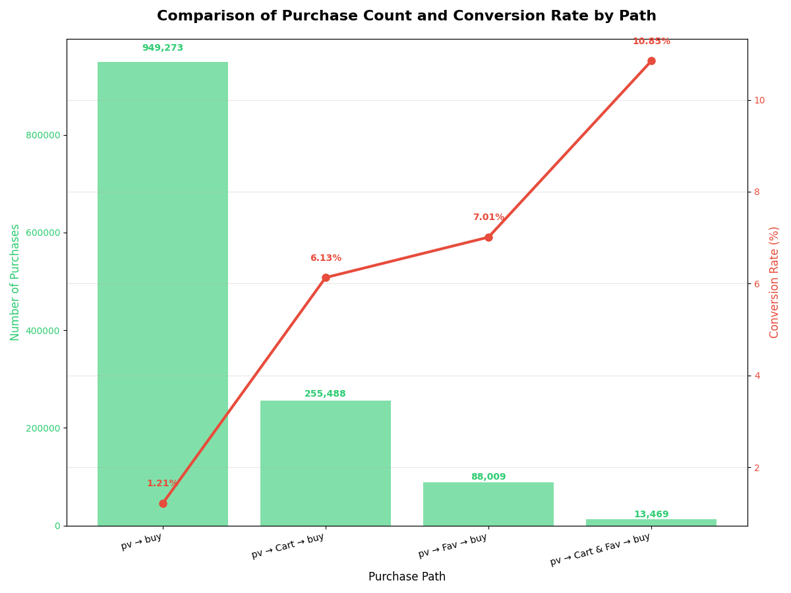
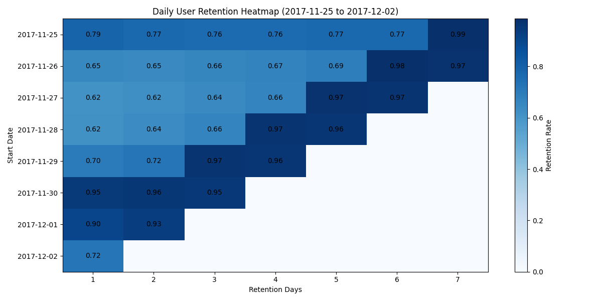
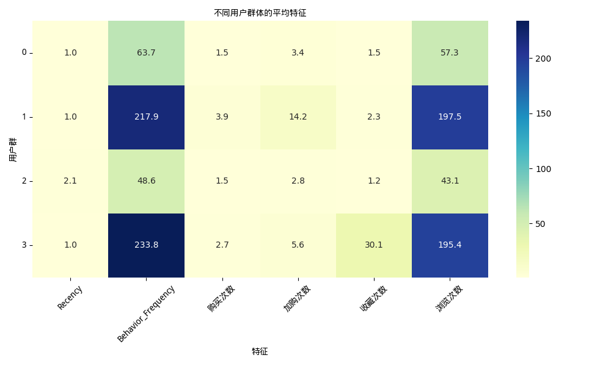

# 🛒 User Behavior Analysis (Alibaba Dataset)

本项目基于阿里巴巴天池 `UserBehavior.csv` 用户行为日志数据，开展多维度的用户行为分析，涵盖数据预处理、漏斗转化率分析、用户画像构建、行为序列挖掘等模块，旨在探索典型用户行为模式与商品转化特征，为产品运营提供数据支持。

---

## 📁 项目结构说明

user-behavior-analysis/
├── notebooks/ # Jupyter分析模块
├── res_figures/ # 所有图表输出
├── requirements.txt # Python环境依赖包
└── README.md # 项目说明文档（当前文件）


---

## 数据集

- https://tianchi.aliyun.com/dataset/649 淘宝用户购物行为数据集

---

## 📊 分析模块概览

### 1️ 数据预处理
- 数据导入
- 数据转换
- 缺失值处理
- 异常值处理
- 重复值处理

### 2️ 用户行为习惯分析
- 页面访问量pv和独立访客数uv
- 平均访问深度和跳失率
- 用户转化情况
- 用户行为路径分析
- 用户留存分析

### 3️ 用户消费习惯分析
- 用户付费率
- 用户购买次数
- 用户复购率
- 商品大类销售分析
- 商品大类行为分析

### 4 用户价值分析
- 基于RFM的k-means聚类分析

---

## 📈 关键图示







---

## ⚙️ 使用环境

本项目基于 Python 3.8+，主要依赖如下包：

```bash
pip install -r requirements.txt

```


## 📋 项目总结结论

### 1.用户行为分析

- pv和uv整体变化趋势相同，11月25日到12月1日之间，uv变化不明显，pv在11月26日达到小高峰，与当天刚好是周六放假密切相关。从12月1日周四开始，pv和uv涨幅明显，12月2日和12月3日与上周相比较，pv环比增长率32.6%,13.1%，uv环比增长率33.5%,28.6%，可见本次活动宣传和引流效果不错,12月3日pv,uv相较于12月2日均有一定下滑，但pv下滑更多，说明吸引了很多用户，并且浏览页面可能比较明确，这应该和活动宣传和引流效果有关。

- 用户的活跃时间从上午10点持续到晚上10点，尤其是从下午6点开始呈现明显上升趋势，到晚上九点左右达到峰值，这符合大多数人的日常作息规律。由此可以建议店铺调整客服工作时间，增加下午6点到晚上10点的客服数量，促使用户从浏览向购买转换。

- 从浏览到加入购物车的转换率为6.17%，收藏商品的转换率为3.22%，最后购买的转换率为2.25%左右。从上面可以看出，加购率（6.17%）偏低，这说明可能存在商品详情页吸引力不足、用户对商品存在疑虑（如评价、售后）、加购流程繁琐等问题。从加购到购买的转化率36.5%（2.25%/6.17%），属于中等水平，但仍有优化空间：未完成支付（购物车页促销信息缺失、运费门槛；加购后缺乏召回手段（如未推送优惠券或库存提醒。当前**核心问题**是 **加购率不足**和**加购后的购买转化效率**，需优先优化商品详情页和购物车流程。

- 浏览—购买路径占比高达**72.67%**，转化率为**1.34%**。可以分析访问量高的商品，吸引用户将其收藏、加购物车，以提高后续转化率等。

- 浏览—加购物车—购买路径占比**19.56%**，转化率为**9.69%**。此路径转化率较高，可以分析最后成交商品在用户加入购物车后的状态，是自身降价还是参与活动促销等；

- 浏览—收藏—购买路径占比**6.74%**，转化率为**7.41%**。可以在收藏界面添加商品动态，或者向用户推送商品补货信息，提高商品转化率。

- 浏览—加购—收藏—购买路径占比**1.03%**，转化率为**16%**。既加购又收藏可说明此类商品比较受用户欢迎，可以挖掘商品共性，扩大其他相似产品的曝光度。

- 优化策略： 流量再分配（建议进行ab测试）措施：在商品页为P1路径用户增加「加入购物车」浮窗提示，对浏览超过30秒的用户自动推送收藏奖励（如「收藏立减5元」）等；

- 路径优化 加购未购用户：加购后24小时推送「库存紧张」提醒；加购后48小时发放限时优惠券（折扣力度建议8-9折）。
收藏未购用户：在收藏夹添加「相似商品降价通知」功能；每周三定时推送「收藏商品专属折扣日」

- 高价值路径(P4)放大  识别P4路径商品特征，将这些商品添加到「猜你喜欢」推荐池；设计组合优惠（如「加购+收藏立享8折」

- 前4天留存呈平缓下降趋势（11-25日：78.87%→76.08%）符合典型用户流失曲线。所有日期在 第5-7天留存突然跃升至95%+（如11-25日的7日留存98.55%）可能原因：周期性活动（如周末促销）、数据采集异常（如自动登录脚本）。新用户质量稳定（前4日留存60-80%）。用户在第3-4天出现小幅度回升（可能因多日登录奖励触发）。

### 2.用户消费习惯分析

- 用户付费率为68.06%，由此说明淘宝用户付费率还是比较高的

- 平均每个用户购买2次，平均每个购买用户购买3次。

- 购买次数为1次的用户数量最多，大约有88%的用户购买次数在5次以内，购买次数在10次以内的用户占总付费用户的98%。

- 用户复购率为66%，用户复购平均间隔1.2天，有超过50%的用户在同一天内产生多笔交易。

- 通过比对商品大类浏览top10和商品大类销售top10可知，存在某些商品浏览量高但成交量相对较低，对此应该分析用户流失原因，对症下药；对于成交量高但浏览量相对较低的商品，是否应该考虑增加商品的曝光率等等。

- 用户簇分析：
  - **簇0**：用户活跃且收藏多，但购买转化较低，适合重点培养促成转化。
  - **簇3**：用户高活跃高转化，是核心客户，建议重点维护。
  - **簇1、簇2**：低活跃用户，尤其簇2为沉睡用户，需通过营销活动唤醒或评估淘汰。

